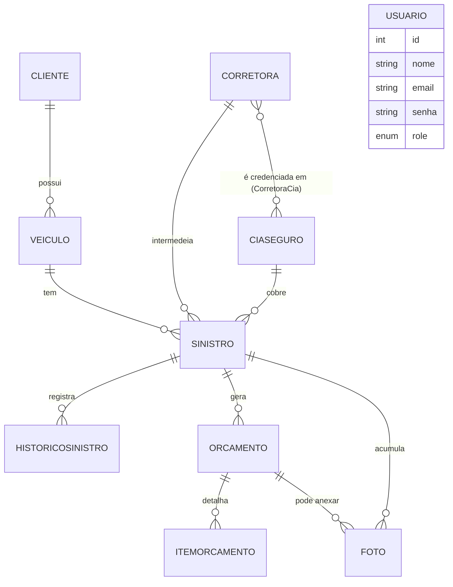

# Garage Controller

Sistema de gestão de sinistros para uma oficina mecânica — do momento em que um veículo entra para reparo (seja por conta do próprio cliente, seja por um sinistro de seguro) até a entrega do carro pronto, passando por vistoria, orçamento, acompanhamento fotográfico e aprovação da seguradora.

Projeto desenvolvido para a disciplina de Programação Full Stack (curso de ADS). Stack: **Node.js + Express + Prisma + PostgreSQL** no backend, **React + Vite + TypeScript** no frontend.

---

## 1. O problema que o sistema resolve

Uma oficina que atende sinistros de seguro (batida, furto parcial, etc.) precisa controlar, para cada veículo que entra:

- **Quem é o dono** do veículo e **qual veículo** é.
- **Como esse atendimento está sendo pago**: o próprio cliente paga (particular) ou é uma seguradora, através de uma corretora, que vai autorizar e pagar (seguro).
- **Quanto vai custar o reparo**: o orçamento inicial (peça por peça) e, se durante o reparo aparecer mais dano do que o previsto, um orçamento complementar.
- **Em que fase o reparo está**: acabou de chegar, está aguardando a seguradora autorizar, já foi autorizado e as peças estão sendo compradas, está em serviço, terminou, foi entregue.
- **Evidências visuais**: fotos do veículo na chegada, durante o reparo e no final, para a seguradora e para o cliente.
- **Onde comprar cada peça pelo melhor preço** — e aqui entra uma IA que pesquisa isso automaticamente.

Esse é o domínio do problema. O modelo de dados do sistema é basicamente a tradução desse parágrafo em tabelas e relacionamentos.

---

## 2. A ideia por trás do modelo de dados (relacionamentos)

O `schema.prisma` divide as entidades em dois grupos, e essa divisão já conta a história do projeto:

- **Cadastro Base**: as entidades "estáticas", que existem independente de qualquer sinistro — são o cadastro que se consulta e reaproveita. `Cliente`, `Veiculo`, `CiaSeguro`, `Corretora`.
- **Núcleo**: o `Sinistro` em si e tudo que gira em torno dele — `HistoricoSinistro`, `Orcamento`, `ItemOrcamento`, `Foto`.

### Diagrama de relacionamentos



(`Usuario` fica isolado no diagrama de propósito: ele não participa do fluxo do sinistro, só controla **quem pode acessar o quê**.)

### Entidade por entidade — e por que ela existe

**`Cliente`** — dono do veículo. Tem `docIdentificacao` único (não pode cadastrar o mesmo documento duas vezes). Um cliente pode ter **vários veículos** (`1:N`).

**`Veiculo`** — pertence a exatamente um `Cliente` (`clienteId` obrigatório). A placa é única no sistema. Um veículo pode passar por **vários sinistros** ao longo do tempo (`1:N`) — faz sentido: o mesmo carro pode bater duas vezes, ou precisar de reparo particular numa ocasião e de seguro em outra.

**`CiaSeguro`** (seguradora) e **`Corretora`** — dois cadastros separados porque, no mundo real, são papéis diferentes: a **seguradora** é quem paga e autoriza o sinistro; a **corretora** é quem intermediou a venda daquele seguro e normalmente acompanha o processo. Por isso o `Sinistro` tem **dois campos opcionais**, `ciaSeguroId` e `corretoraId` — opcionais porque um atendimento `PARTICULAR` não tem nenhum dos dois.

**`CorretoraCia`** — a tabela de **credenciamento**: qual corretora trabalha com qual seguradora. É um relacionamento **N:N** clássico (uma corretora vende seguro de várias cias, uma cia é vendida por várias corretoras), resolvido com uma tabela associativa cuja chave primária é o par `(corretoraId, ciaId)` — ou seja, o mesmo par não pode ser cadastrado duas vezes como vínculo, mas **pode** ser reaproveitado em quantos sinistros novos forem necessários (o vínculo é sobre a *relação comercial*, não sobre um atendimento específico).

**`Sinistro`** — o centro de tudo. Pertence a um veículo, tem um tipo de atendimento (`PARTICULAR` ou `SEGURO`), e se for `SEGURO` precisa informar cia + corretora (essa regra é validada na API, não só no banco). Tem um `statusAtual` que é um **enum fixo de 6 fases** (não texto livre, de propósito — texto livre permite digitar "Em andamento", "andamento", "Andamento..." e quebrar qualquer filtro/relatório):

`INICIAL → AGUARDANDO_AUTORIZACAO → AUTORIZADO_COMPRA_PECAS → EM_SERVICO → FINALIZADO → ENTREGUE`

**`HistoricoSinistro`** — um **log cronológico** de tudo que aconteceu com o sinistro (`1:N` a partir de `Sinistro`). Cada mudança de status gera uma linha aqui, com data/hora e observação livre — é o que permite reconstruir a timeline completa depois.

**`Orcamento`** — também `1:N` a partir de `Sinistro`, porque **um sinistro pode ter mais de um orçamento**: o `INICIAL` (levantamento assim que o carro chega) e, se aparecer dano extra durante o reparo, um ou mais `COMPLEMENTAR` (o `tipo` é um enum com só essas duas opções, e existe um campo `versao` para numerar quando há mais de um).

**`ItemOrcamento`** — cada **peça** dentro de um orçamento (`1:N` a partir de `Orcamento`): código da peça, descrição, valor, e um conjunto de datas que acompanha o ciclo de compra (pedido → faturamento → previsão de chegada → chegada real). Também guarda o resultado da **consulta por IA** (`iaLocaisCompra`, `iaFaixaPreco`, `iaDica`, `iaConsultadoEm`) — a pesquisa de "onde comprar mais barato" fica salva por peça, não precisa ser refeita toda vez que a tela é aberta.

**`Foto`** — pertence a um `Sinistro` e, **opcionalmente**, também a um `Orcamento` específico (`orcamentoId` opcional) — isso permite tanto fotos gerais do veículo (vinculadas só ao sinistro) quanto fotos que documentam especificamente um orçamento complementar (por exemplo, a foto do dano extra que justificou pedir mais peças). Tem um `momento` (`INICIAL`, `ACOMPANHAMENTO` ou `FINAL`) que organiza a timeline visual do reparo.

**`Usuario`** — fora do fluxo do sinistro. Tem um `role` (`ADMIN`, `GERENTE`, `FUNCIONARIO`) que controla permissões — explicado na seção 4.

### Por que separar assim, e não tudo numa tabela só?

Porque as entidades têm **ciclos de vida diferentes**. Um cliente e seus veículos existem antes, durante e depois de qualquer sinistro. Uma corretora e uma cia de seguro existem independente de qualquer atendimento específico. Já o histórico, o orçamento e as fotos só fazem sentido *dentro* de um sinistro e morrem junto com ele (conceitualmente). Modelar isso como tabelas separadas com chave estrangeira é o que permite, por exemplo, que a tela "Histórico por Placa" busque um veículo e junte automaticamente **todos** os sinistros, **todos** os orçamentos, **todas** as fotos daquele carro, sem duplicar dado nenhum.

---

## 3. Arquitetura e tecnologias

```
Garage-Controller/
├── sinistros_back/     → API REST (Node + Express + TypeScript)
│   ├── prisma/          → schema.prisma, migrations, seed
│   ├── src/
│   │   ├── routes/       → um arquivo por entidade (clientes.ts, sinistro.ts, ...)
│   │   ├── middlewares/  → autenticação e controle de perfil (auth.ts)
│   │   ├── services/     → consultaIA.ts (integração com IA)
│   │   └── server.ts     → monta o Express e registra as rotas
│   └── scripts/         → scripts utilitários (ex.: seed de demonstração)
└── sinistros_front/    → SPA (React + Vite + TypeScript)
    └── src/
        ├── *.tsx          → uma tela por arquivo (Clientes.tsx, Sinistros.tsx, ...)
        ├── api.ts         → helper central de chamadas à API (anexa o token JWT)
        └── context/       → estado global do usuário logado (Zustand)
```

**Backend**: Express 5, Prisma ORM sobre PostgreSQL, autenticação com **JWT** (`jsonwebtoken`) e senha com hash via **bcrypt**, validação de entrada com **Zod** em toda rota de escrita, documentação automática da API com **Swagger**, upload/entrega de arquivos com **Multer** + `express.static`, integração com a API do **Google Gemini** (`@google/genai`) para a consulta de peças por IA.

**Frontend**: React 19 + Vite, roteamento com **React Router**, formulários com **React Hook Form** + **Zod** (mesma biblioteca de validação dos dois lados, o schema é só reescrito), estado global leve com **Zustand** (guarda o usuário logado e o token), gráficos do dashboard com **Recharts**, notificações (toasts) com **Sonner**, estilo com **Tailwind CSS**.

---

## 4. Autenticação e controle de acesso (RBAC)

O login (`POST /login`) verifica e-mail + senha (hash comparado com `bcrypt.compare`) e devolve um **token JWT** contendo o id, nome e `role` do usuário, válido por 1 hora. Esse token vai no header `Authorization: Bearer <token>` em **toda** chamada seguinte — o helper `apiFetch` do frontend cuida disso automaticamente, e desloga sozinho se a API responder `401` (token expirado ou inválido).

No backend, duas camadas de middleware:

- **`autentica`** — roda em **todas** as rotas, exceto `/login` e `/uploads` (as fotos precisam ser carregáveis direto numa tag ``, que não envia o token). Sem token válido, `401`.
- **`requireRole(...)`** — aplicado em rotas específicas, exige que o `role` do token esteja numa lista de perfis permitidos. Sem a permissão certa, `403`.

Três perfis:

| Perfil | O que pode fazer |
|---|---|
| **FUNCIONARIO** | Operação do dia a dia: cadastrar cliente/veículo, abrir e acompanhar sinistro, orçamento, fotos, consulta de IA. |
| **GERENTE** | Tudo que o Funcionário faz, **mais** o Dashboard (indicadores consolidados). |
| **ADMIN** | Tudo, **mais** gerenciar usuários (criar, editar login/senha/perfil, remover). |

Duas regras de segurança valem a pena mencionar porque são o tipo de detalhe que mostra cuidado de implementação:

- Um **ADMIN não consegue remover o próprio acesso de administrador** nem a si mesmo (evita o sistema ficar sem nenhum admin por engano).
- Trocar a senha na edição de um usuário é **opcional** — o campo pode ficar em branco, e aí a API simplesmente não inclui `senha` no `update`, preservando o hash atual. Só valida e recria o hash se algo foi digitado.

---

## 5. O fluxo funcional (a jornada de um sinistro)

Esse é o roteiro que vale mais a pena treinar para a apresentação, porque mostra o sistema sendo usado do jeito que ele foi pensado:

1. **Login** — entra com e-mail/senha, recebe o token.
2. **Cadastrar o cliente** (tela Clientes → "+ Novo Cliente"). Ao salvar, o sistema já **navega direto para cadastrar o veículo** desse cliente (fluxo guiado, sem precisar procurar o cliente de novo).
3. **Cadastrar o veículo** — placa, marca, modelo, ano. Ao salvar, navega direto para **abrir o sinistro** desse veículo, já pré-selecionado.
4. **Abrir o sinistro** — escolhe particular ou seguro (se seguro, informa cia + corretora + apólice) e a km do atendimento. Nasce com status `INICIAL`.
5. **Acompanhar pela tela "Histórico por Placa"** — busca pela placa e vê tudo junto: dados do cliente/veículo, todos os sinistros daquele carro, e dentro de cada sinistro:
   - As **fases percorridas** (visual) e o botão **"Avançar status"**, que atualiza o sinistro e já registra automaticamente uma linha no histórico de andamento.
   - As **fotos**, organizadas por momento (Inicial / Acompanhamento / Final).
   - As **peças do orçamento**, com a opção de **consultar a IA** para saber onde comprar cada uma mais barato (ver seção 6).
   - A opção de abrir um **orçamento complementar**, se durante o reparo aparecer mais dano.
6. **Finalizar e entregar** — avança o status até `FINALIZADO` e depois `ENTREGUE`, fechando o ciclo.

Em paralelo, a qualquer momento: Corretoras e Seguradoras podem ser cadastradas e vinculadas entre si (tela própria), e um ADMIN pode gerenciar os usuários do sistema.

---

## 6. Funcionalidade extra: consulta de peça por IA

Cada item de orçamento tem um botão "Consultar IA" que manda a descrição da peça + dados do veículo para o **Gemini**, com a ferramenta de **busca do Google** ativada (`googleSearch`), pedindo 2 a 4 resultados reais de onde comprar aquela peça, com preço e link. O resultado fica **salvo no banco** (não precisa refazer a busca toda vez que a tela abre).

Como a API do Gemini tem um plano gratuito com **cota limitada**, foi implementado um **fallback**: se a chamada à IA falhar (cota estourada, por exemplo), em vez de mostrar um erro, o sistema devolve uma recomendação genérica e honesta (categorias de fornecedor — concessionária, marketplace, desmanche — sem inventar nome de loja específico nem link, porque um link fictício que não abre é pior do que não ter link). A tela nunca fica "quebrada" por causa de uma falha de um serviço externo.

---

## 7. Decisões de design que valem a pena saber explicar

- **Por que status do sinistro é enum e não texto livre?** Para garantir consistência (não existe "em andamento", "Em Andamento" e "ANDAMENTO" like three status diferentes por erro de digitação) e permitir agrupar/filtrar com segurança no Dashboard.
- **Por que o vínculo Corretora×Cia não pode ser removido se já tem sinistro usando aquela combinação?** Para não quebrar a integridade do histórico — se o vínculo sumisse, um sinistro antigo ficaria "órfão" de uma relação comercial que de fato existiu. A mesma combinação **pode**, porém, ser reaproveitada livremente em sinistros **novos**.
- **Por que os campos de Corretora/Cia de Seguro viraram obrigatórios?** Decisão consciente de que, num cadastro desse tipo, dado incompleto (sem telefone, sem responsável) atrapalha mais do que ajuda no dia a dia da oficina.
- **Por que a consulta de IA tem fallback em vez de só mostrar erro?** Serviço externo gratuito pode falhar por motivo fora do controle do sistema (cota). A experiência do usuário não deveria depender 100% de uma API de terceiros.

---

## 8. Como rodar o projeto localmente

```bash
# Backend
cd sinistros_back
npm install
npx prisma generate
npm run dev            # http://localhost:3000

# Frontend (em outro terminal)
cd sinistros_front
npm install
npm run dev            # http://localhost:5173
```

Variáveis de ambiente necessárias: `sinistros_back/.env` com `DATABASE_URL`, `JWT_KEY` e `GEMINI_API_KEY`; `sinistros_front/.env` com `VITE_API_URL` apontando para o backend.

A documentação interativa de todas as rotas da API fica em `http://localhost:3000/docs` (Swagger).

---

## 9. Estado atual do projeto

O sistema cobre o ciclo completo do sinistro — cadastro, acompanhamento, orçamento (inicial e complementar), fotos, consulta de peça por IA e controle de acesso por perfil — com CRUD completo (criar, listar, editar e remover, com as travas de integridade necessárias) em todas as entidades: Clientes, Veículos, Usuários, Corretoras, Seguradoras e seus vínculos.

Como próximos passos naturais (fora do escopo entregue, mas pensados durante o desenvolvimento): deploy em produção com armazenamento de arquivo persistente para as fotos (hoje elas ficam em disco local do servidor), e troca ou balanceamento entre provedores de IA para reduzir a dependência da cota gratuita de um único serviço.
